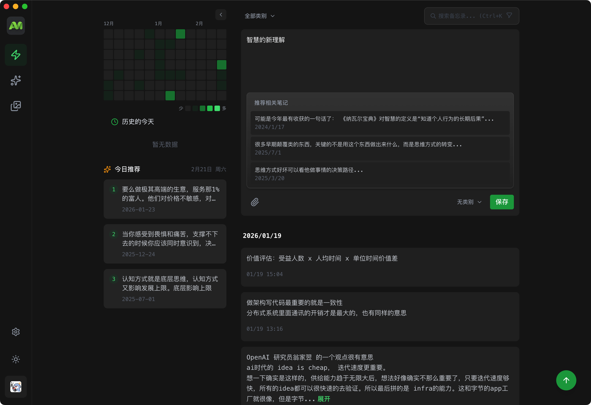
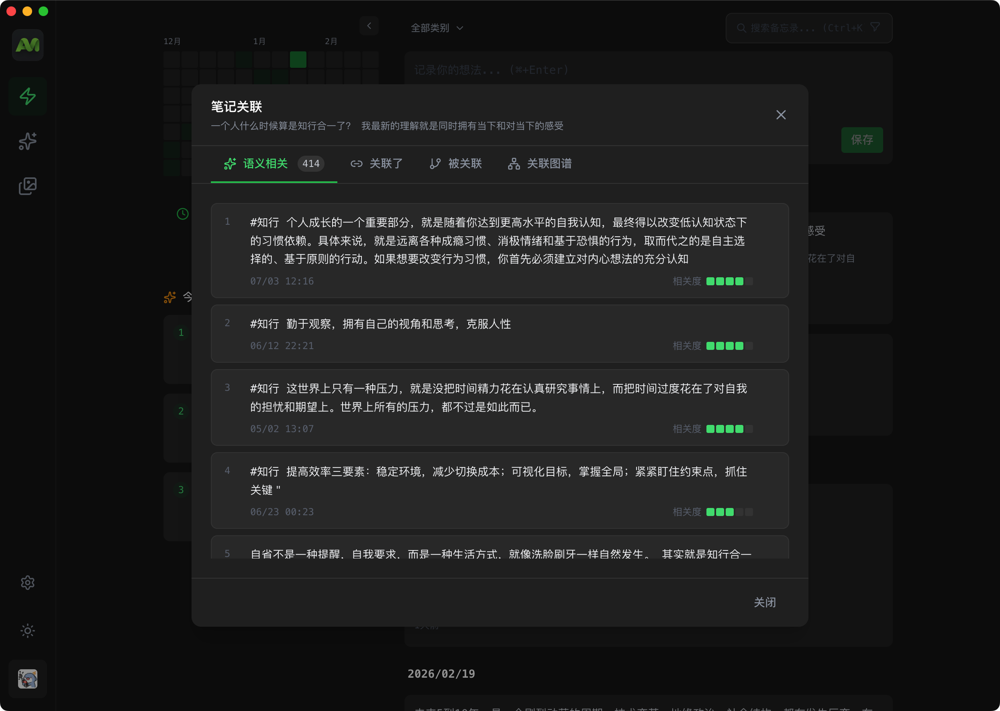
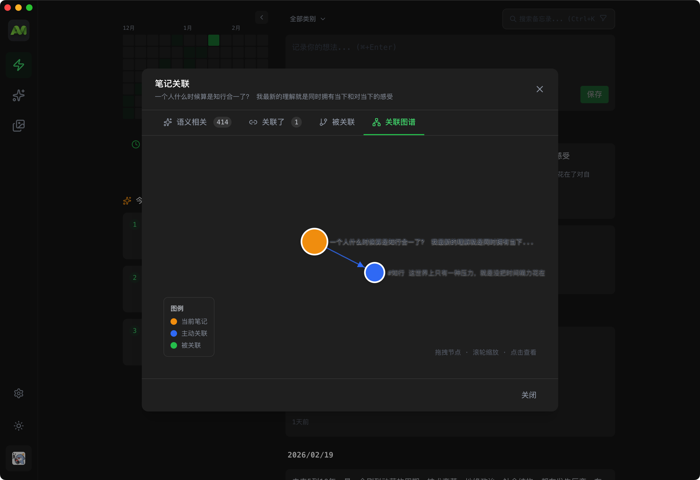
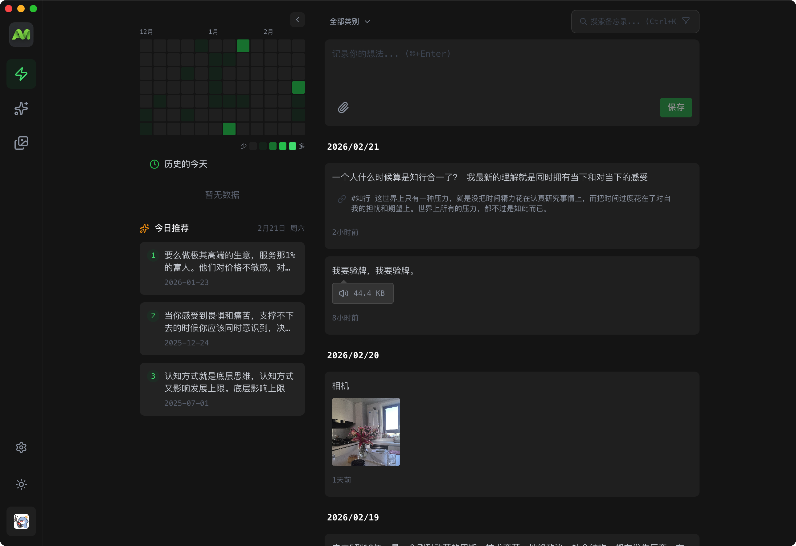
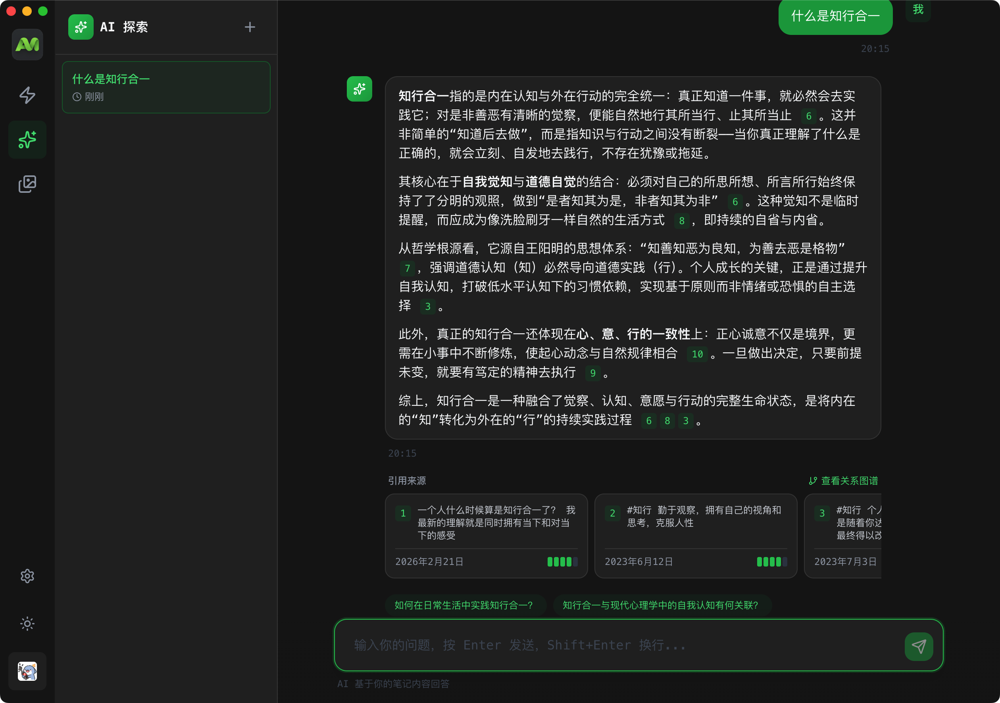
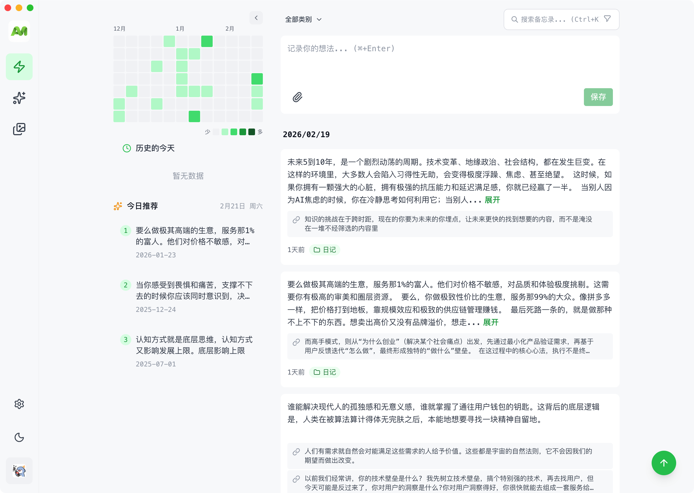

# 🚀 AIMO - AI 驱动的智能笔记系统

[](https://github.com/ximing/aimo/actions/workflows/ci.yml)
[](https://github.com/ximing/aimo/actions/workflows/docker-publish.yml)


[English](./README_EN.md) | 简体中文

一个现代化的 AI 驱动笔记与知识管理工具，融合语义搜索、智能关联、多端同步，帮助你构建属于自己的知识图谱。



## ✨ 核心功能

### 🤖 AI 智能能力

- **智能摘要** - AI 自动生成笔记摘要，快速提炼关键信息
- **语义搜索** - 基于 OpenAI Embedding 的向量搜索，理解含义而非匹配关键词
- **智能关联** - 自动发现笔记间的关联关系，构建可视化知识图谱
- **每日推荐** - 智能推荐"历史上的今天"记录的笔记，重温过往灵感

### 📝 笔记管理

- **颜色分类** - 10+ 种彩色标签，直观区分笔记类型
- **分类管理** - 多级分类体系，灵活组织知识结构
- **版本历史** - 笔记修改历史追踪，随时回溯
- **关系图谱** - 可视化展示笔记间的引用和关联关系

### 🔍 发现与搜索

- **全文搜索** - 快速检索笔记标题和内容
- **标签过滤** - 按标签快速筛选笔记
- **日历热力图** - 可视化展示笔记活跃度，点击日期快速筛选
- **智能排序** - 支持时间、相关度等多种排序方式

### 💻 多端支持

- **Web 应用** - 响应式设计，支持桌面和移动端浏览器
- **桌面客户端** - Electron 应用，支持 macOS、Windows、Linux
- **移动应用** - Android APK 支持，iOS 待上架
- **浏览器扩展** - 快速收藏网页内容（开发中）

### 🎨 个性化

- **深色/亮色主题** - 一键切换，呵护双眼
- **PWA 支持** - 可安装为桌面应用，离线使用
- **快捷键** - Ctrl+K 快速搜索，提升操作效率

## 📸 界面预览

|                 智能笔记编辑                  |                   语义搜索                    |                   知识图谱                    |
| :-------------------------------------------: | :-------------------------------------------: | :-------------------------------------------: |
|  |  |  |

|                   多媒体支持                    |                     AI 探索                     |                   主题切换                    |
| :---------------------------------------------: | :---------------------------------------------: | :-------------------------------------------: |
|  |  |  |

## 🚀 快速开始

### 环境要求

- **Node.js** >= 20.0
- **pnpm** >= 10.0
- **MySQL** >= 8.0 或 MariaDB >= 10.6
- **OpenAI API Key** - 用于 AI 功能

### 本地开发

```bash
# 1. 克隆项目
git clone https://github.com/ximing/aimo.git
cd aimo

# 2. 安装依赖
pnpm install

# 3. 配置 MySQL 数据库
# 创建数据库
mysql -u root -p
CREATE DATABASE aimo CHARACTER SET utf8mb4 COLLATE utf8mb4_unicode_ci;
EXIT;

# 或使用 Docker 启动 MySQL
docker-compose up -d mysql

# 4. 配置环境变量
cp .env.example .env
# 编辑 .env，填入 MySQL 连接信息、JWT_SECRET 和 OPENAI_API_KEY

# 5. 启动开发服务器
pnpm dev

# 应用将在 http://localhost:3002 启动
```

### 常用命令

```bash
pnpm dev:web       # 仅启动前端
pnpm dev:server    # 仅启动后端
pnpm dev:client    # 启动 Electron 桌面端
pnpm build         # 构建所有应用
pnpm lint          # 代码检查
pnpm format        # 代码格式化
```

## 🐳 Docker 部署

### 使用预构建镜像

```bash
docker pull ghcr.io/ximing/aimo:stable

docker run -d \
  -p 3002:3002 \
  --name aimo \
  --env-file .env \
  -v $(pwd)/data:/app/data \
  ghcr.io/ximing/aimo:stable
```

## 📥 下载客户端

|  平台   |                          下载链接                          |   系统要求    |
| :-----: | :--------------------------------------------------------: | :-----------: |
|  macOS  |   [下载](https://github.com/ximing/aimo/releases/latest)   |   macOS 12+   |
| Windows |   [下载](https://github.com/ximing/aimo/releases/latest)   |  Windows 10+  |
|  Linux  |   [下载](https://github.com/ximing/aimo/releases/latest)   | Ubuntu 20.04+ |
| Android | [下载](https://github.com/ximing/aimo-app/releases/latest) | Android 8.0+  |
|   iOS   |                           待上架                           |       -       |

## ⚙️ 环境变量配置

### 必需配置

```env
# JWT 密钥（至少 32 个字符）
JWT_SECRET=your-super-secret-key

# OpenAI API 密钥
OPENAI_API_KEY=sk-xxx...

# MySQL 数据库连接
MYSQL_HOST=localhost
MYSQL_PORT=3306
MYSQL_USER=root
MYSQL_PASSWORD=your-mysql-password
MYSQL_DATABASE=aimo
```

### 数据库配置

AIMO 使用混合数据库架构：

- **MySQL** (via Drizzle ORM) - 存储所有关系型数据（用户、笔记、分类、标签等）
- **LanceDB** - 存储向量嵌入用于语义搜索

```env
# MySQL 配置（必需）
MYSQL_HOST=localhost
MYSQL_PORT=3306
MYSQL_USER=root
MYSQL_PASSWORD=your-mysql-password
MYSQL_DATABASE=aimo
MYSQL_CONNECTION_LIMIT=10

# LanceDB 配置（向量存储）
LANCEDB_STORAGE_TYPE=local
LANCEDB_PATH=./lancedb_data
```

### 附件存储

```env
# 存储类型: local 或 s3
ATTACHMENT_STORAGE_TYPE=local
ATTACHMENT_LOCAL_PATH=./attachments
ATTACHMENT_MAX_FILE_SIZE=52428800  # 50MB
```

更多配置请参考 [.env.example](./.env.example)

## 📁 项目结构

```
aimo/
├── apps/
│   ├── web/              # React 前端应用
│   ├── server/           # Express 后端服务
│   ├── client/           # Electron 桌面端
│   └── extension/        # 浏览器扩展
├── packages/
│   └── dto/              # 共享类型定义
├── docker-compose.yml    # Docker 部署配置
└── package.json          # 根配置文件
```

## 🤝 贡献指南

1. Fork 本仓库
2. 创建功能分支 (`git checkout -b feature/amazing-feature`)
3. 提交更改 (`git commit -m 'Add amazing feature'`)
4. 推送到分支 (`git push origin feature/amazing-feature`)
5. 创建 Pull Request

## 📄 许可证

本项目采用 [Business Source License 1.1 (BSL 1.1)](./LICENSE) 协议。

- ✅ **允许**: 个人使用、非商业用途、企业内部使用
- ❌ **禁止**: 商业服务、商业产品集成
- 💼 **商业许可**: 如需商业使用，请联系获取授权

## 📞 联系我们

- 📧 邮箱: morningxm@hotmail.com
- 🐛 Issues: [GitHub Issues](https://github.com/ximing/aimo/issues)
- 💬 Discussions: [GitHub Discussions](https://github.com/ximing/aimo/discussions)

---

<p align="center">
  Made with ❤️ by <a href="https://github.com/ximing">ximing</a>
</p>
